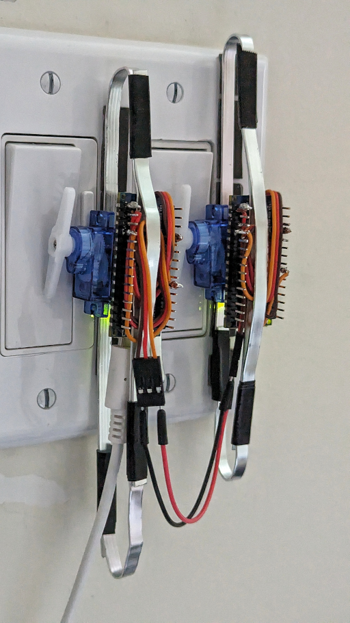

# serfSwitch

An Arduino-based smart "switch" that fits over a regular switch and physically flips it on demand (because we're all just renters these days).

Uses [MQTT](https://mqtt.org/) to integrate with [Home Assistant](https://www.home-assistant.io/).

> My first electronics project!

## Requirements

- [Arduino Nano ESP32](https://docs.arduino.cc/hardware/nano-esp32)
- [Small servo motor](https://www.amazon.ca/dp/B0BMFY8SX8?psc=1&ref=ppx_yo2ov_dt_b_product_details)
- Tools and other materials:
  - [Soldering kit](https://www.amazon.ca/dp/B085Y328GK?psc=1&ref=ppx_yo2ov_dt_b_product_details)
  - [Wire stripper/cutter](https://www.amazon.ca/dp/B073YG65N2?ref=ppx_yo2ov_dt_b_product_details&th=1)
  - [Jumper wires (male/female)](https://www.amazon.ca/IZOKEE-240pcs-Solderless-Breadboard-Arduino/dp/B08151TQHG/ref=sr_1_5?crid=36ZMSYJOC62IM&keywords=female+jumper&qid=1693773281&sprefix=female+jumer%2Caps%2C309&sr=8-5)
  - [Aluminium strips](https://www.amazon.ca/dp/B07PDDCMC5?psc=1&ref=ppx_yo2ov_dt_b_product_details)
  - [Strong double-sided tape](https://www.amazon.ca/dp/B07PYG86FC?psc=1&ref=ppx_yo2ov_dt_b_product_details)
  - Optional [breadboard](https://www.amazon.ca/BB400-Solderless-BreadBoard-tie-Points-Backing/dp/B00Q9G8MQS)
- Infrastructure
  - [Mosquitto](https://mosquitto.org/) or other MQTT server install
  - [Home Assistant](https://www.home-assistant.io/) install with the [MQTT integration](https://www.home-assistant.io/integrations/mqtt/) connected

## Usage

1. Copy `creds.template.h` to `creds.h` and fill it out.
2. Strip a centimeter or so of insulation off each of the three wires of the servo (power, ground, control).
3. Do the same for 3 wires that end in female jumper pins. Coordinating colour with the 3 servo wires is recommended.
4. Manually twist the exposed end of the power wire from the servo motor with a corresponding female jumper wire for a loose attachment.
5. Do the same for the servo ground wire.
6. Solder the 2 power wires (that were twisted together to form "one wire") to the `VIN` pin on the Arduino.
   - You could use the breadboard to prototype everything first.
7. Solder the "merged" ground wire to one of the `GND` pins on the Arduino.
8. Solder the servo control wire to either the `D6` or `D7` ports on the Arduino.
   - Only one pin is techniclly used but the code outputs to both - this is a lazy way to "correct" a soldering error in my build.
   - You can modify the code to use any other digital pins if needed.
9. Solder the remaining hanging wire (the third female jumper wire) to the `VBUS` pin on the Arduino.
10. Connect a USB-C power supply to the device. It should show up in Home Assistant with a permanent randomly-generated ID, and should be usable immediately.
    - Depending on the motor used and how you set it up, you may need to modify some variables under `// Hardware config` - experiment with what values work for you.
    - Note that the code does support a push button connected to pin `D5`, but I ended up not using one for my build.
11. Use the aluminium strips and double sided tape to securely mount everything over your existing dumb switch.
    - Obviously, skip this in the prototyping stage.
12. The female jumpers are used to power a second switch without needing a second USB-C power supply.
    - Using a male-male wire, connect the `VBUS`-attached pin of the USB-powered switch to the `VIN`-attached (power) pin on the second switch.
    - Do the same to connect the `GND`-attached pins of both switches.
    - Due to power constraints, only 1 switch can be attached in this way.

## Result

Hey, I never said it was pretty.

## Potential Improvements

- Use a cheaper ESP32 board instead of the Arduino (the Arduino IDE and language should still be usable - it isn't clear if code changes would be needed).
- Use a board without header pins soldered on.
- Make use of a push button for manual control.
- Design and 3D print a housing (neater and better looking than the current system).
- See if the board can be put into sleep mode for 5-10 seconds between syncs to save power. This will result in less responsiveness but it's a decent compromise if it makes a [battery powered solution](https://www.amazon.ca/dp/B076TFJBHW) more viable. The current system only lasts about 20 hours when powered by [high-capacity 9v batteries](https://www.amazon.ca/dp/B018N7YZL6).
